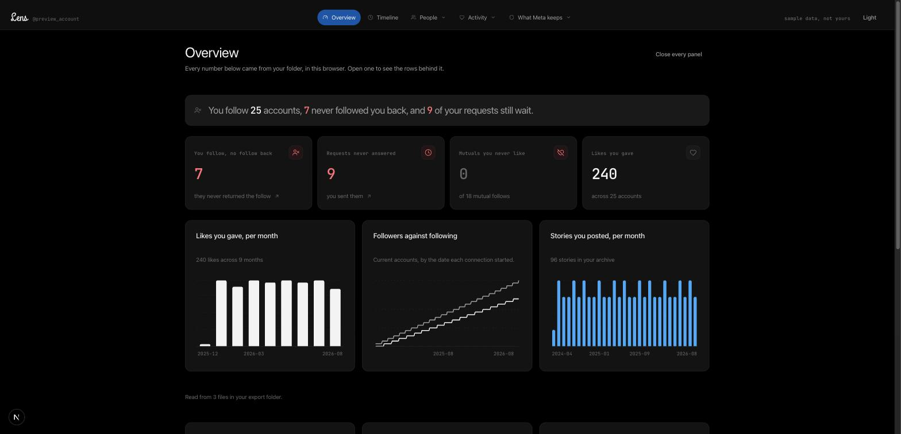
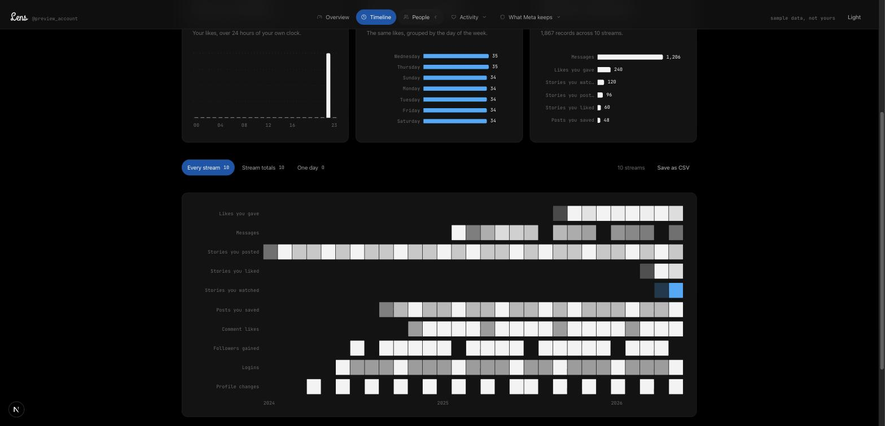
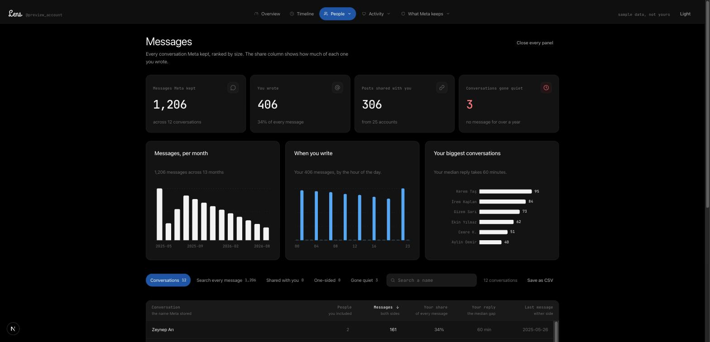
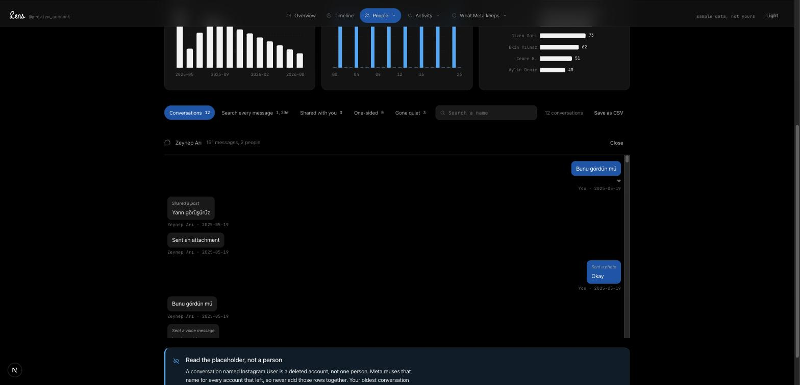
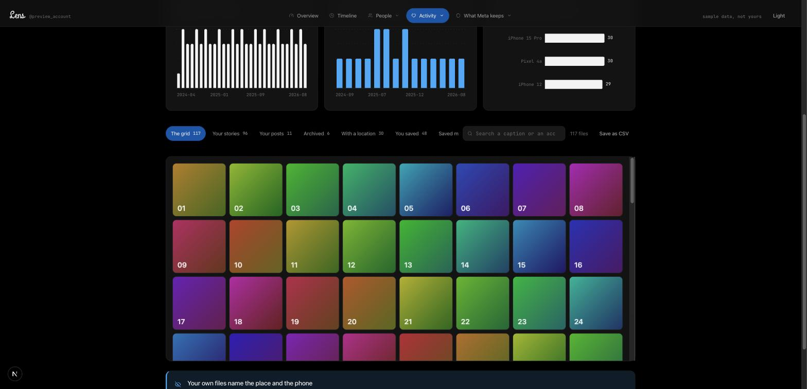
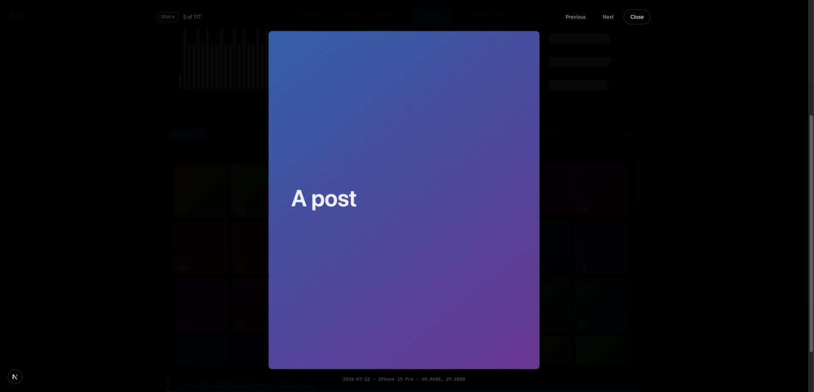

<div align="center">

<picture>
  <source media="(prefers-color-scheme: dark)" srcset="docs/wordmark-dark.svg">
  
</picture>

### Read your Instagram export on your own machine

**No upload. No account. No server.**

[**Open Lens**](https://lens.chele.bi) · [**See the demo**](https://lens.chele.bi/preview/)

[MIT license](LICENSE) · [Privacy and security](SECURITY.md) · [Deployment](docs/deployment.md)

</div>

---

Instagram shows you who you follow. Lens compares who follows you back, which
follow request has waited five years, and which of your mutuals never once got
a like from you. Lens reads the export without an Instagram password.

You request your data from Meta. You drop the folder on the page, or drag the
zip files straight onto it. The page parses it in your browser and shows the
dashboard.

---

## The privacy claim, and how to check it

**Lens does not upload your export.** The browser reads the files and computes the results locally.

The hosted page downloads its own scripts, styles, and fonts. The host can log those page requests. Export contents do not enter those requests. Profile links open Instagram only when you select them.

The production build uses `connect-src 'none'`. Other directives restrict forms, frames, plugins, and remote assets. These controls support the privacy claim. They do not protect against a compromised host or browser extension.

Open DevTools and watch the Network tab during import. For offline use, install dependencies, build Lens, and serve it locally. Development mode needs a local hot-reload connection. Both development and build commands disable Next.js telemetry.

Lens stores the theme choice. Export data stays in memory until you close the export, reload, or close the tab. Files you download as CSV or image cards remain on your disk.

Read [SECURITY.md](SECURITY.md) for the threat model, import limits, policy exceptions, and reporting instructions.

---

## Get your export

1. In Instagram settings, open Accounts Center, then Your information and permissions. Find the export or download option.
2. Select your Instagram account, all available information, **All time**, and **JSON**. Export to your device.
3. Wait for Meta to send a download notice. Download every archive part.
4. Open Lens. Choose the folder you unzipped, or open the zip files as they
   are. Select all archive parts together. If extracted files exceed 512 MB, extract them first and choose the folder.

---

## What it looks like

Every screenshot below comes from the demo, which runs on invented data.

### The dashboard

| Overview                                                                     | Timeline                                                               |
| ---------------------------------------------------------------------------- | ---------------------------------------------------------------------- |
| One sentence reads the whole export. Four numbers open the rows behind them. | Every timestamped stream on one axis. The blue row holds 30 days only. |
|              |    |

### Your messages

| Every conversation                                                     | One conversation                                                          |
| ---------------------------------------------------------------------- | ------------------------------------------------------------------------- |
| Ranked by size, with your share of each one and your median reply gap. | Open a row and read the words. Your side sits right.                      |
|        |  |

### Your media

| The grid                                                         | One file, open                                                             |
| ---------------------------------------------------------------- | -------------------------------------------------------------------------- |
| Every photo and video you posted, read from your own disk.       | Its date, its caption, its device and its coordinate. The arrow keys move. |
|  |         |

---

## Every feature

Seventeen tabs. Each one holds a headline number, up to three charts, a
filtered table and a CSV export.

### People

| Tab             | What it answers                               | Views                                                                                              |
| --------------- | --------------------------------------------- | -------------------------------------------------------------------------------------------------- |
| **Connections** | Who follows back in this export               | No follow back · Fans · Mutuals · Following · Followers · You unfollowed · Blocked · Close friends |
| **Requests**    | The follow requests nobody answered           | You sent, unanswered · Waiting on you · Recent, you sent                                           |
| **Messages**    | Every conversation, with a real search        | Conversations · Search every message · Shared with you · One-sided · Gone quiet                    |
| **People**      | One closeness score for everybody you message | Your closest people · Drifting · You write more · They write more · No username                    |
| **Person**      | One account, every record your export holds   | Search a username, then open one row                                                               |
| **Growth**      | The follow-back rate by year                  | Follow-back by year · The curve · Who moved first · Reciprocity clock                              |

### Activity

| Tab              | What it answers                            | Views                                                                                       |
| ---------------- | ------------------------------------------ | ------------------------------------------------------------------------------------------- |
| **Likes**        | Whom you like, and whom you never like     | By account · Never liked · One-sided · Hashtags · Every like                                |
| **Stories**      | Whose stories you watch and like           | You watch · You like · Watched, never liked · Mutuals you skip · You answered               |
| **Your content** | Your posts, stories, saved list and places | The grid · Your stories · Your posts · Archived · With a location · You saved · Saved music |

### What Meta keeps

| Tab                 | What it answers                                 | Views                                                                                                          |
| ------------------- | ----------------------------------------------- | -------------------------------------------------------------------------------------------------------------- |
| **Security**        | Every login, address, device and account change | Every session · By address · Devices · Account changes                                                         |
| **Tracking**        | Advertisers, contacts and in-app browsing       | Advertisers · Your contacts · Categories · Suggested to you · In-app browsing · Apps                           |
| **Identity**        | Years of profile changes, and what Meta stores  | Your version history · What Meta stores · Searches · Exports you asked for · Notes and reposts                 |
| **Compare exports** | Who left, since your last export                | They unfollowed you · They followed you · You unfollowed · You followed · Requests accepted · Requests dropped |
| **Share a card**    | The headline numbers, with every name removed   | Square 1080 by 1080 · Story 1080 by 1920, over eleven metrics                                                  |
| **What Lens read**  | Every file, and what each one gave              | Every file · Loaded · Empty · Absent · Files skipped                                                           |

### Always on

| Tab          | What it answers                                   | Views                                           |
| ------------ | ------------------------------------------------- | ----------------------------------------------- |
| **Overview** | The whole export in one sentence and four numbers | Fourteen breakdown rows, each one opens its tab |
| **Timeline** | Every timestamped stream on one axis              | Every stream · Stream totals · One day          |

### Across every tab

| Feature           | What it does                                          |
| ----------------- | ----------------------------------------------------- |
| Search            | Filters the table on a username, a name or a caption  |
| Sort              | Every column sorts, and the table keeps the order     |
| CSV export        | Writes the visible rows to a file, in the browser     |
| Close every panel | Hides the numbers and the table, and keeps the charts |
| Light and dark    | One click, and the choice persists                    |
| Charts            | Hover any bar, line or cell for the exact value       |
| Media             | Reads your photos and videos from disk, on demand     |
| Retention notice  | Every short-window view states its own window         |

---

## What the export cannot tell you

Lens states these limits on screen.

| Question                       | Answer                                                                                 |
| ------------------------------ | -------------------------------------------------------------------------------------- |
| Who liked my posts?            | The export holds no inbound-like data. No file names them.                             |
| Who viewed my story?           | The same. Meta gives you no viewer list.                                               |
| Who visited my profile?        | The same. No file records a profile view.                                              |
| When did somebody unfollow me? | The follower list is a survivor list, not a history. Compare two exports to answer it. |

Retention runs from 30 days to 6 years. `stories_viewed` and `link_history`
hold 30 days. `recently_unfollowed_profiles` holds 59 days. Every view over a
short-window file states the window on screen.

---

## Run it

Node 24 LTS is the tested runtime. Install the locked dependencies, then start the production build:

```bash
npm ci
npm run build
npm start
```

Open `http://127.0.0.1:4174`, then choose a folder or zip files. The server binds to your own machine only.

For development:

```bash
npm run dev
```

Open `http://127.0.0.1:4173`. Development needs its local hot-reload connection and a less restrictive policy.

Set `NEXT_PUBLIC_SITE_URL` before the public build. Use the domain where Lens will run. The variable is public metadata, not a secret. See [deployment instructions](docs/deployment.md).

### Commands

| Command                  | What it does                                          |
| ------------------------ | ----------------------------------------------------- |
| `npm run verify`         | Everything below, in order                            |
| `npm run typecheck`      | `tsc --noEmit`                                        |
| `npm run lint`           | ESLint, zero warnings allowed                         |
| `npm run format:check`   | Prettier                                              |
| `npm run check:comments` | Fails on a comment in the source                      |
| `npm run check:tokens`   | Fails on a raw colour, pixel or rem value             |
| `npm run check:case`     | Fails on all-capital text                             |
| `npm run check:csp`      | Fails if the source policy loses `connect-src 'none'` |
| `npm run check:network`  | Fails on a network call                               |
| `npm run check:layers`   | Fails if `lib/` imports a component                   |
| `npm run check:build`    | Fails if a built page weakens the policy              |
| `npm test`               | Vitest tests with synthetic data                      |
| `npm run test:export`    | Optional checks against your own export               |

`npm run verify` runs in continuous integration and in the pre-commit hook. A
commit that fails it never lands.

---

## How it is built

| Part        | Choice                                                      |
| ----------- | ----------------------------------------------------------- |
| Framework   | Next.js 15, static export, no server                        |
| Interface   | React 19 with StyleX, every value from one token file       |
| Charts      | Recharts for the five chart types, visx for the heatmap     |
| Parsing     | A Web Worker owns the export, so the interface never blocks |
| Zip reading | `fflate`, in the browser                                    |
| Tests       | Vitest, on a synthetic fixture and on a real export         |

The parser handles what a Meta export actually contains.

| Trap                     | How Lens handles it                                                                                       |
| ------------------------ | --------------------------------------------------------------------------------------------------------- |
| Every string is mojibake | Meta writes UTF-8 and escapes it as Latin-1. Lens decodes on read, never at render time.                  |
| Two record shapes        | `label_values` and `string_map_data`. The nested `Owner` dict names the account behind a liked post.      |
| Numbered files           | `followers_1.json` becomes `followers_2.json` on a large account. Lens globs, and never hardcodes a name. |
| A 10,000 message cap     | `message_1.json` stops at 10,000. Lens groups by folder, so one conversation stays one row.               |
| `Instagram User`         | That is the placeholder for a deleted account, not a person. Lens never merges those threads.             |
| A missing file           | Absent, not an error. An empty file is empty, not broken. The coverage tab reports both.                  |

---

## Licence

MIT. See [LICENSE](LICENSE).

To run the optional export checks, set `LENS_EXPORT` to your extracted folder before `npm run test:export`. These tests never need a committed export.

## Languages

Choose English or Türkçe in the header. Lens remembers the language locally and keeps imported account text unchanged. Read [the language guide](docs/languages.md) before adding interface text.
